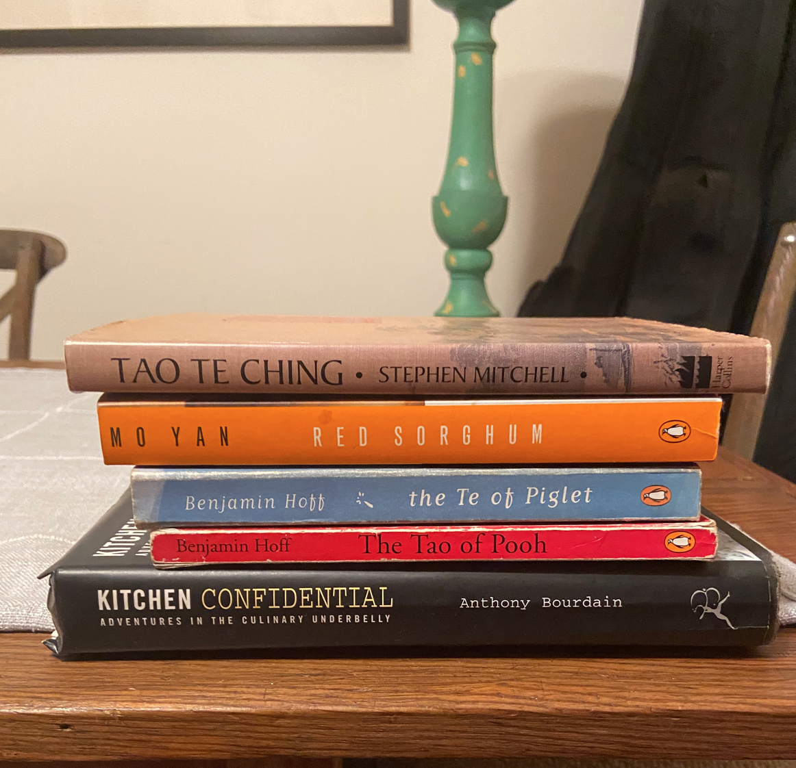
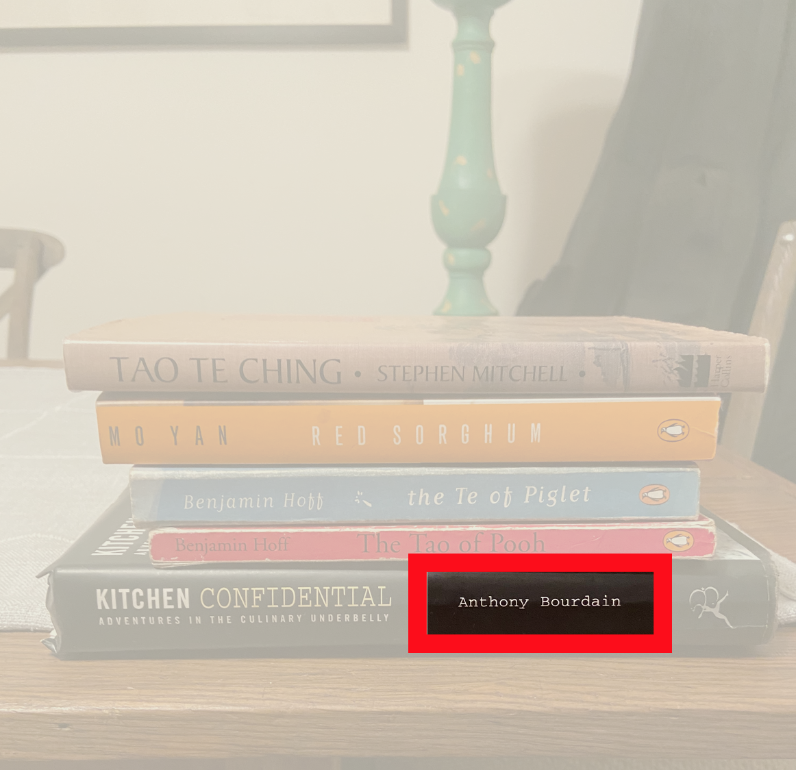
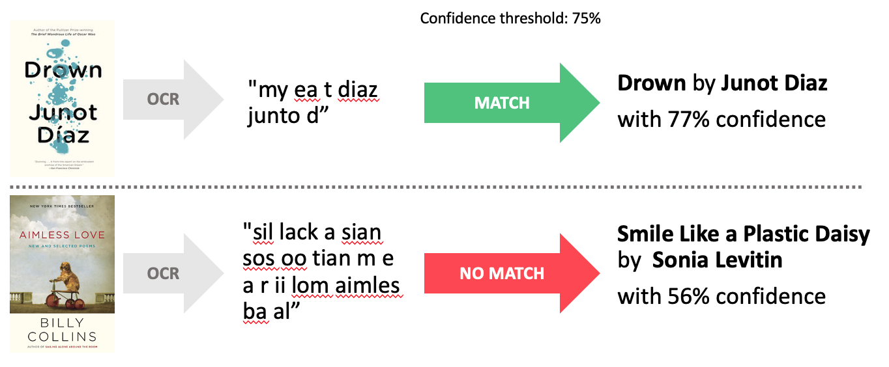

# SoftCopy: Image-based Text Detection

Max Currier

### What is SoftCopy?

* Get book recommendations from just an image of your bookshelf

* Effortlessly leverage your offline book collection to generate insights

* Simply upload a photo and the app does the rest!

### Methodology
After a user uploads their photo, the app goes through 3 main phases:

1. Optical character recognition (OCR)
2. Text matching
3. Recommendations

### Optical Character Recognition

SoftCopy leverages OpenCV and Pytesseract to perform OCR. Images pass through the following processing pipeline:

1. **Preprocessing**
  * Image scaling

  * Color swapping

  * Mean image subtraction

    

2. **Text detection**
 * OpenCV EAST text detection model performs ounding box detection
 * Non-maxima suppression
  * OpenCV EAST text detection model detects clusters of text and records coordinates of bounding boxes

  * Non-maxima suppression removes weak and overlapping boxes

    

3. **Text recognition**
  * Bounding boxes pass through Pytessaract pre-trained LSTM neural network model where text in each box is interpreted

  * Pytessaract returns text from each bounding box

    

### Text matching

  * 266,664 book titles pulled from the [Book Crossing](http://www2.informatik.uni-freiburg.de/~cziegler/BX/) dataset
  * Each cluster of text read in by OCR gets paired with a title and author from the database using a five-step fuzzy matching process
  * User sets confidence threshold to determine cutoff point for matches

  

### Recommendation
  * Collaborative filtering suggests books based on user ratings. Because this approach is strictly based off of user behavior, it should be able to exploit some hidden correlations in the data

  * Singular value decomposition (SVD) breaks ratings into 800 abstract categories

  * Cosine similarity determines closest match!

### Tools
* Jupyter Notebook
* Atom
* Pytesseract
* OpenCV
* PIL
* Fuzzywuzzy
* Sci-kit learn
* Scipy
* Pandas
* Numpy
* Matplotlib
* Seaborn
* Re
* String
* Pickle
